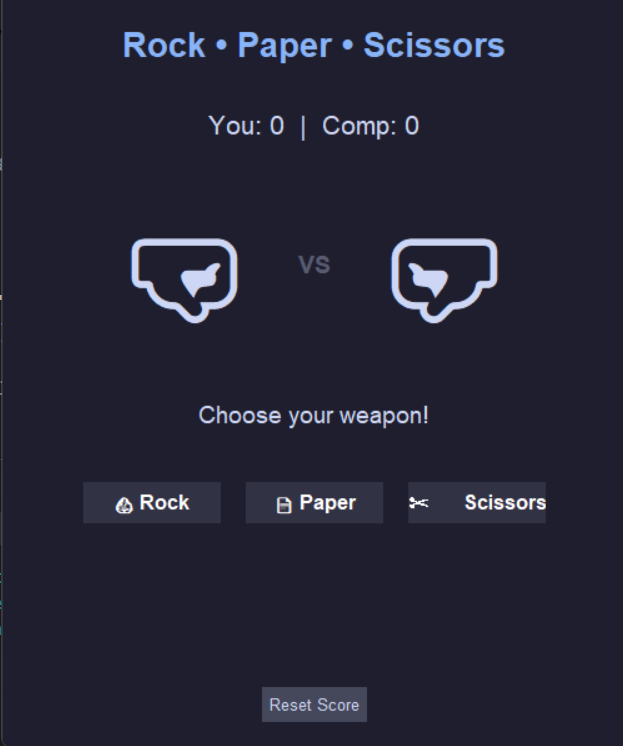

# ✂️ Rock Paper Scissors (Modern GUI)


A clean, modern, and "better looking" Rock Paper Scissors game built using Python and **Tkinter**. This project moves away from the standard gray windows, utilizing a modern dark color palette and large unicode emojis for a responsive and attractive user interface.

## 📸 Preview



> *Note: If you haven't added a screenshot yet, this area will be blank.*

## ✨ Features

* **Modern Dark Theme:** Uses a "Catppuccin/Dracula" inspired color scheme (`#1e1e2e` background) that is easy on the eyes.
* **No External Assets:** Uses High-Quality Unicode Emojis (🪨, 📄, ✂️) for graphics, meaning no need to download or manage separate image files.
* **Dynamic Feedback:**
    * <span style="color:#a6e3a1">**Green text**</span> when you win.
    * <span style="color:#f38ba8">**Red text**</span> when you lose.
    * <span style="color:#f9e2af">**Yellow text**</span> for ties.
* **Scoreboard:** Keeps track of Player vs. Computer wins in real-time.
* **Reset Function:** A dedicated button to wipe the scoreboard and start fresh.

## 🛠️ Prerequisites

You need **Python 3** installed on your system.
*Tkinter* is included with Python by default on Windows and macOS.

**For Linux Users:**
If you are on Linux (Ubuntu/Debian), you may need to install tkinter manually:
```bash
sudo apt-get install python3-tk


